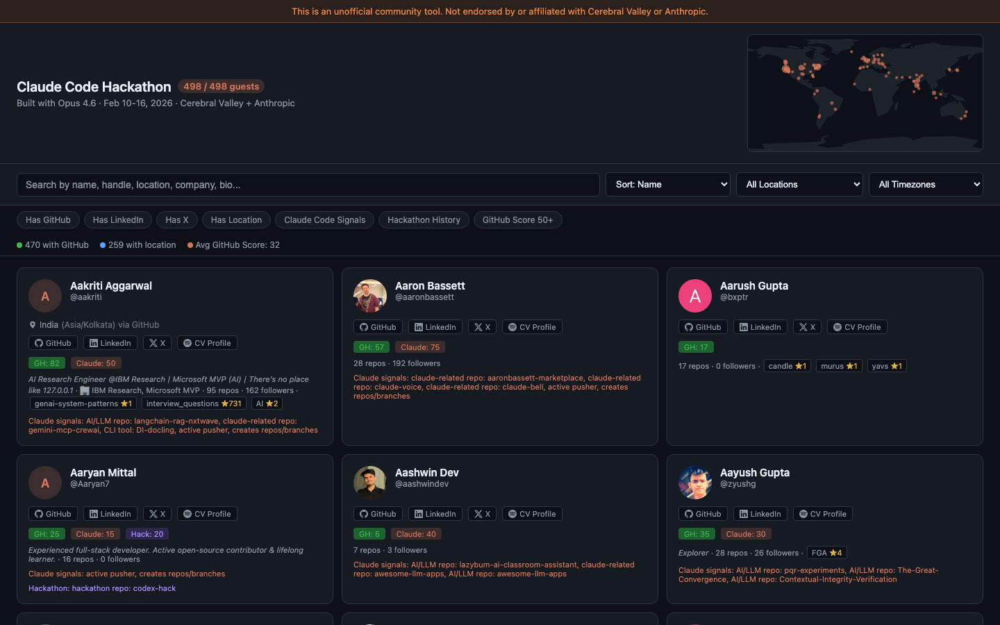

# CV Hackathon Team Finder

A guest explorer for the [Claude Code Hackathon](https://cerebralvalley.ai/) (Feb 10-16, 2026), hosted by Cerebral Valley + Anthropic.

Browse, search, and filter 498 hackathon participants by name, location, GitHub activity, and more.

**Live app:** https://cv-hackathon.vercel.app/

## Features

- Full-text search across names, handles, bios, and companies
- Location dropdown with normalized locations (155 raw variants consolidated to ~98 canonical forms)
- Timezone filtering
- Toggle filters: Has GitHub, Has LinkedIn, Has X, Has Location, Claude Code Signals, Hackathon History, GitHub Score 50+
- Interactive world minimap showing participant distribution
- Sort by name, GitHub score, or Claude score
- Links to GitHub, LinkedIn, X, and Cerebral Valley profiles

## Disclaimer

This is an unofficial community tool. Not endorsed by or affiliated with Cerebral Valley or Anthropic.
